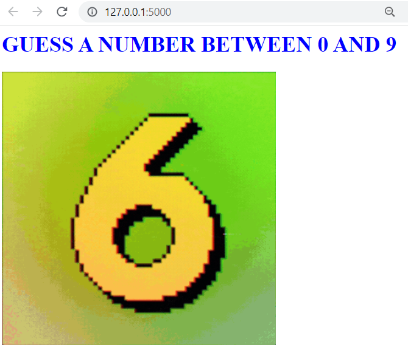
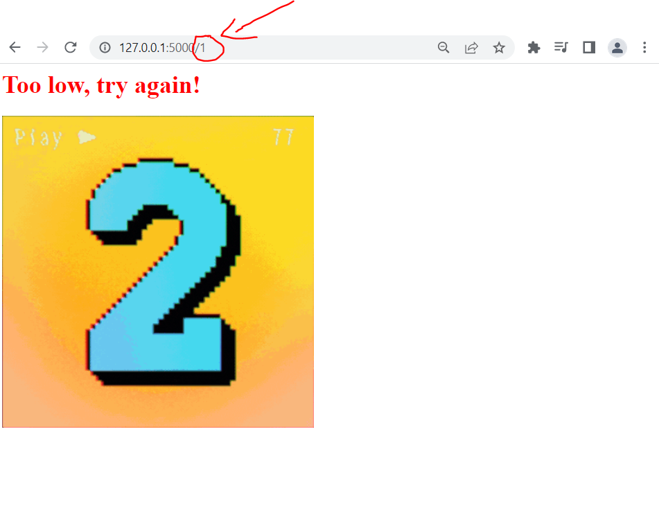
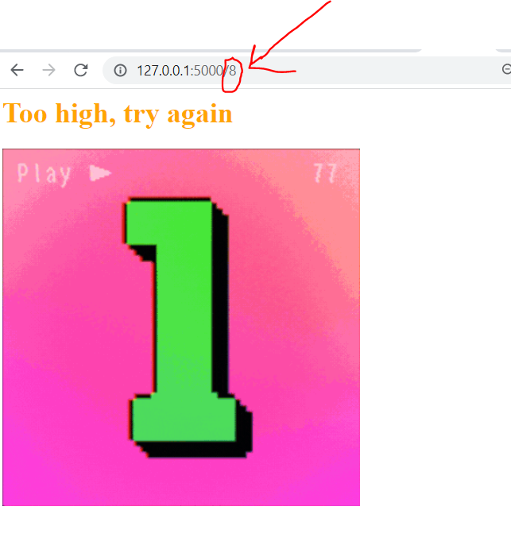
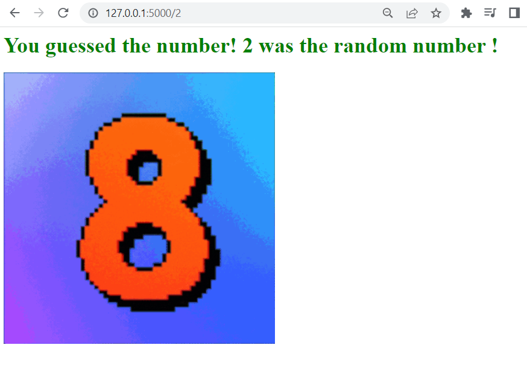

# 01_Guess_The_Number_game

This is a simple web app developed using Python's web framework, Flask. The user will play a guess the number game, where on the main page the user will be prompted with a question of selecting a number between 0 and 9 and a changing number animation.
The user is supposed to type the guessed number into the path. The web app will then tell us whether we chose the right number or if our guess was too low or high.

---

Flask 
https://flask.palletsprojects.com/en/2.1.x/ 

---

The necessary steps to make the program work: 
1. Install the required libraries from the requirements.txt using the following command:  
*pip install -r requirements.txt* 

---

**Examples of views from the website:** 

***The home page.*** 
 

***The user's input of 1 - was a too low guess.*** 
 

***The user's input of 8 - was a too high guess.*** 
 

***The user's input of 2 - was the correct guess.*** 
 

---

**The program was developed using python 3.10.6, Flask 2.2.**

In order to run the program, you have to execute main_flask.py.
