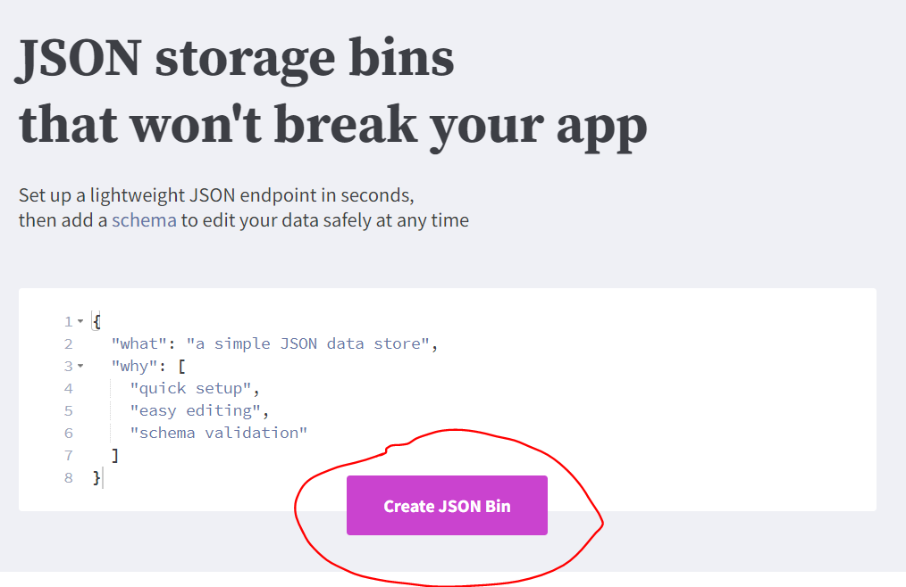
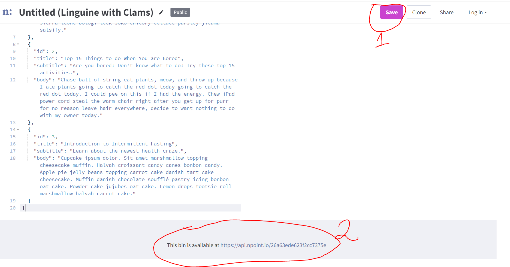
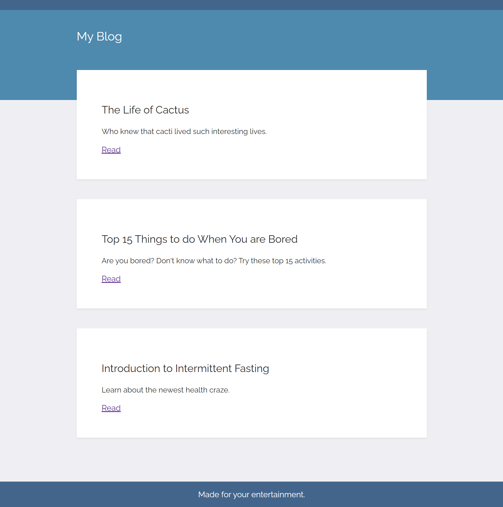
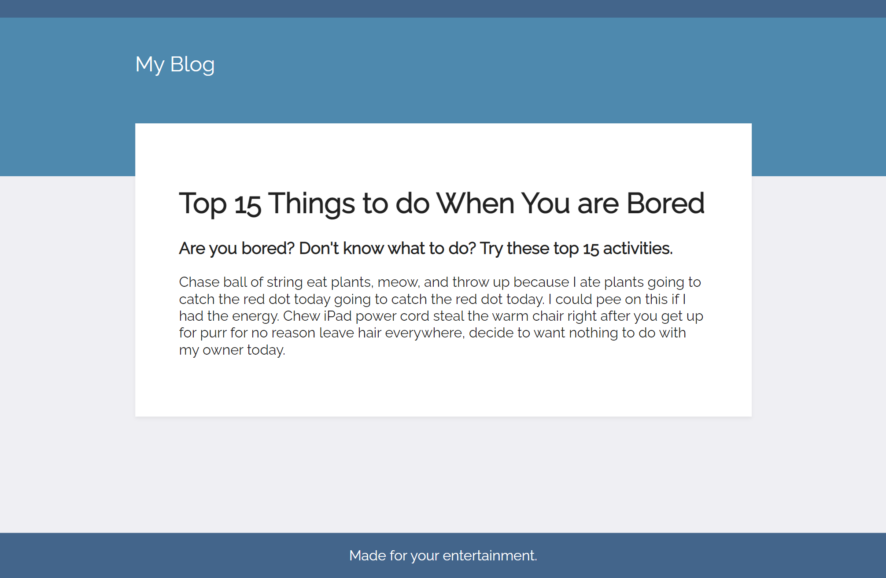

# 03_Blog_website

This is a blog website developed using Python's web framework, Flask.
The main page consists of a list of posts, with the option "Read", which will redirect the user into a detailed view of the given post.
The data for each post is stored using an API (https://www.npoint.io/), which converts our data into an easily accessible API endpoint. The blog website makes a request to this endpoint and retrieves a JSON data representation for each post, which is later rendered into HTML. 

---

Flask 
https://flask.palletsprojects.com/en/2.1.x/ 

JSON storage bins  
https://www.npoint.io/  

---

The necessary steps to make the program work: 
1. Install the required libraries from the requirements.txt using the following command:  
*pip install -r requirements.txt* 
2. Create your own JSON storage bin using https://www.npoint.io/API.
Navigate to the above website and start with "Create JSON Bin". In the next step, copy the data from the blog-data.txt file and paste it into the npoint.io API.
Save the newly copied data and copy your api.npoin endpoint that you can find at the bottom of the website.
Next, you need to adjust the variable *API_NPOINT_ENDPPOINT* in server.py.

 
 

---

**Example views from the website:** 

***The home page.*** 
 

***Detail Post view.*** 
 

---

**The program was developed using python 3.10.6, Flask 2.2**

In order to run the program, you have to execute server.py.
