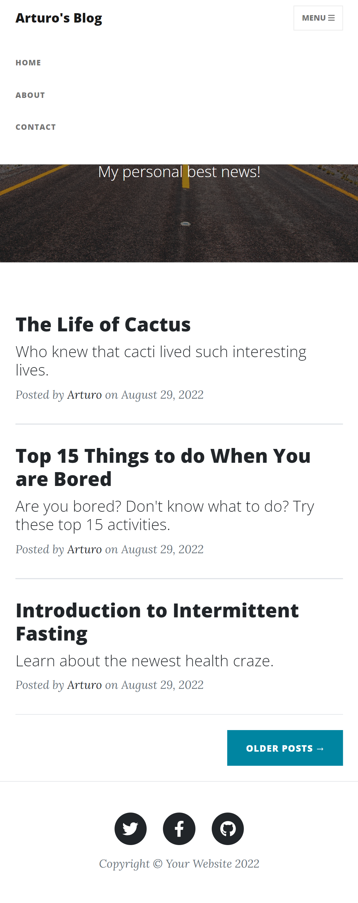

# 04_Blog_website_part_II

This is a blog website that is basically an upgraded version of the 03_Blog_website, which was built using the Python framework Flask. The styling was done with the help of additional Bootstrap templates (https://startbootstrap.com/previews/clean-blog), Bootstrap 5, CSS, and JS. The main features are: 
- multi-page website with an interactive navigation bar, 
- dynamically generated blogpost pages with full screen titles, 
- fully mobile responsive with an adaptive navigation bar, 
- fully functional contact form (POST request - Flask) that will send an email form to the specified email receiver, 

The data for each post is stored using an API (https://www.npoint.io/), which converts our data into an easily accessible API endpoint. The blog website makes a request to this endpoint and retrieves a JSON data representation for each post, which is later rendered into HTML.

The main page consists of a list of posts (titles and subtitles), with the option to open each post, which will redirect the user into a detailed view of the given post.
The adaptive navabr has the options of about, contact, and home page. The contact view has a form where the user can fill up the required data and send it to the server as a POST request, which will be processed and sent to the given email address in the form with the short message.

---

Flask 
https://flask.palletsprojects.com/en/2.1.x/ 

JSON storage bins  
https://www.npoint.io/  

Jinja templates 
https://jinja.palletsprojects.com/en/3.1.x/ 

Bootstrap  
https://getbootstrap.com/  

Email SMTP  
https://docs.python.org/3/library/smtplib.html  

---

The necessary steps to make the program work: 
1. Install the required libraries from the requirements.txt using the following command:  
*pip install -r requirements.txt* 
2. Before using the program, we need to create a Gmail account that the program can use and generate an app_pssword for our account (https://help.prowly.com/how-to-create-use-gmail-app-passwords). After creating the Gmail account, we have to change the name of .env.example to .env and define the environmental variables according to our account: 
MY_EMAIL = "EXAMPLE.USER@gmail.com" 
GMAIL_APP_PASSWORD = "GMAIL_APP_PASSWORD" 
3. Create your own JSON storage bin using https://www.npoint.io/API.
Navigate to the above website and start with "Create JSON Bin". In the next step, copy the data from the blog-data.txt file and paste it into the npoint.io API.
Save the newly copied data and copy your api.npoin endpoint that you can find at the bottom of the website.
Next, you need to adjust the variable *API_NPOINT_ENDPPOINT* in server.py.

 
 

---

**Example views from the website:** 

***The home page - desktop view.*** 
 

***The home page - mobile view.*** 
 

***The About page.*** 
 

***Detailed post view.*** 
 

***The Contact page with the contact form filled in.*** 
 

***After successfully submitting the contact form, the contact page appears with a message*** 
 

***Example email received from the website.*** 
 

---

**The program was developed using python 3.10.6, Flask 2.2, requests, Email SMTP**

In order to run the program, you have to execute main.py.
And your website will be accessible under localhost:5000 (http://127:0:0:1:5000).