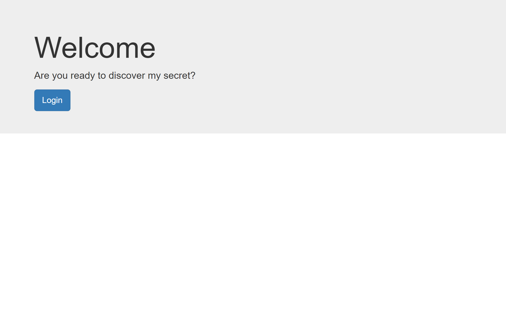
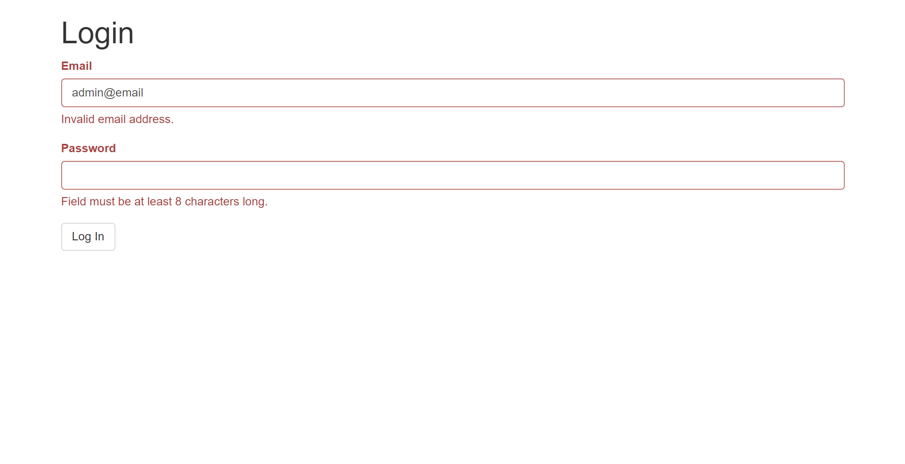
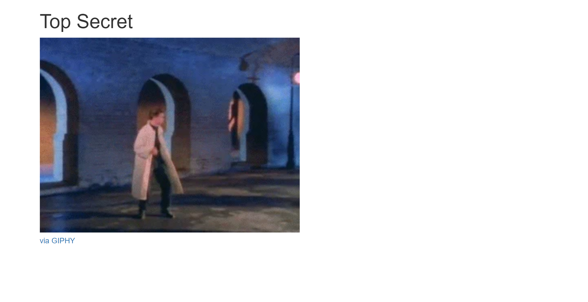
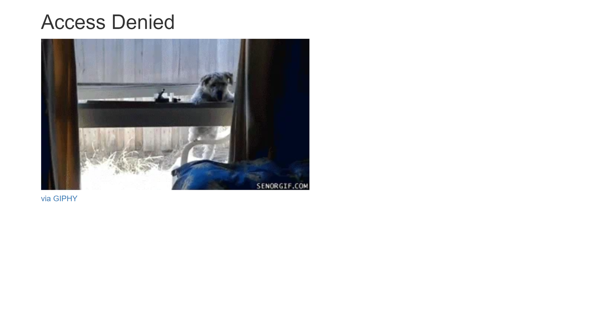

# 05_Flask_WTForms

This is an example project in Flask showing how to start using the Flask-WTF, which gives a number of benefits over the simple HTML form.
With easy form validation, it makes sure that the user is entering the data in the required format and fields, with less code, and build in CSRF Protection (CSRF stands for Cross Site Request Forgery).
This website consists of the main page with a login button. After pressing it, the user gets transferred to the login page,
where an email and password are required. The "secret" is revealed to the user after entering the correct email address and password; otherwise, the user is presented with an access denied website.
Main Features include: Inheriting Templates Using Jinja2, Jinja2 - templates, Flask-Bootstrap, Flask-WTF, WTForms, Forms validation. 

---

Flask 
https://flask.palletsprojects.com/en/2.1.x/ 

Jinja templates 
https://jinja.palletsprojects.com/en/3.1.x/ 

WTForms 
https://wtforms.readthedocs.io/en/2.3.x/ 

Flask-WTF 
https://flask-wtf.readthedocs.io/en/1.0.x/ 

Flask-Bootstrap 
https://pythonhosted.org/Flask-Bootstrap/index.html# 

---

The necessary steps to make the program work: 
1. Install the required libraries from the requirements.txt using the following command:  
*pip install -r requirements.txt* 
2. Change the name of .env.example to .env and define the environmental variable (https://flask.palletsprojects.com/en/2.2.x/config/#SECRET_KEY): 
FLASK_SECRET_KEY = "your_secret_key_keep_it_secret" 

 
 

The correct user data to reveal the secret: 
email: admin@email.com 
password: 12345678 

---

**Example views from the website:** 

***The home page.*** 
 

---

***The Log in page.*** 
 

---

***The Log in - success page.*** 
 

---

***The Log in - deny page.*** 
 

---

**The program was developed using python 3.10.6, Flask 2.2, Flask-WTF, Jinja2, Flask-Bootstrap**

In order to run the program, you have to execute main.py.
And your website will be accessible under localhost:5000 (http://127:0:0:1:5000).
