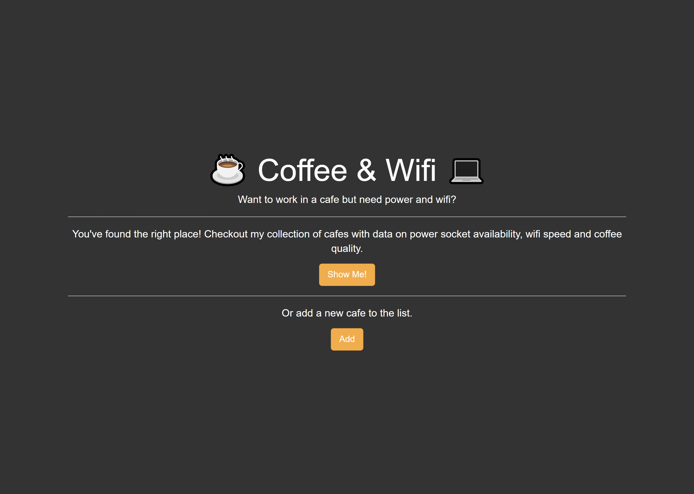
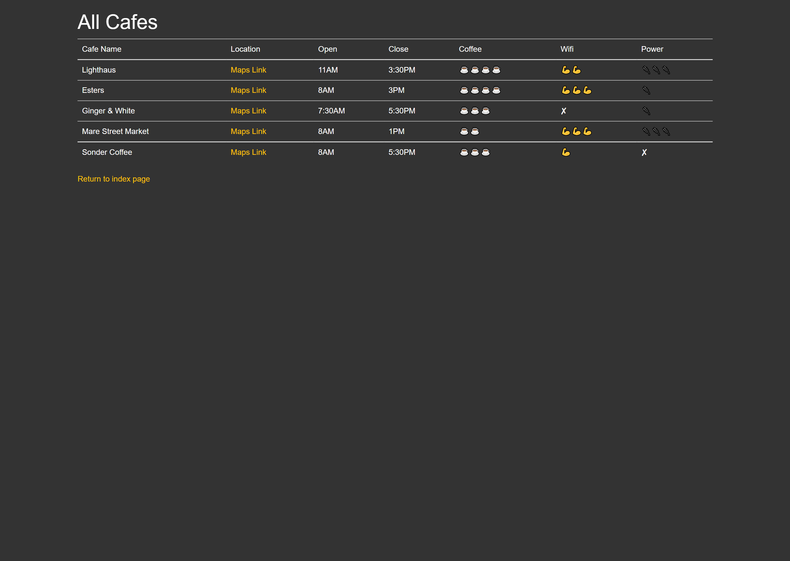
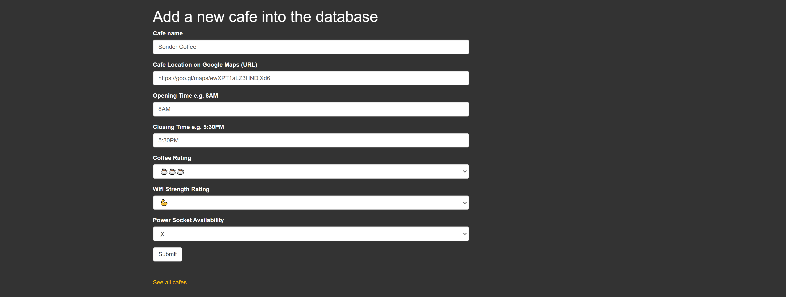
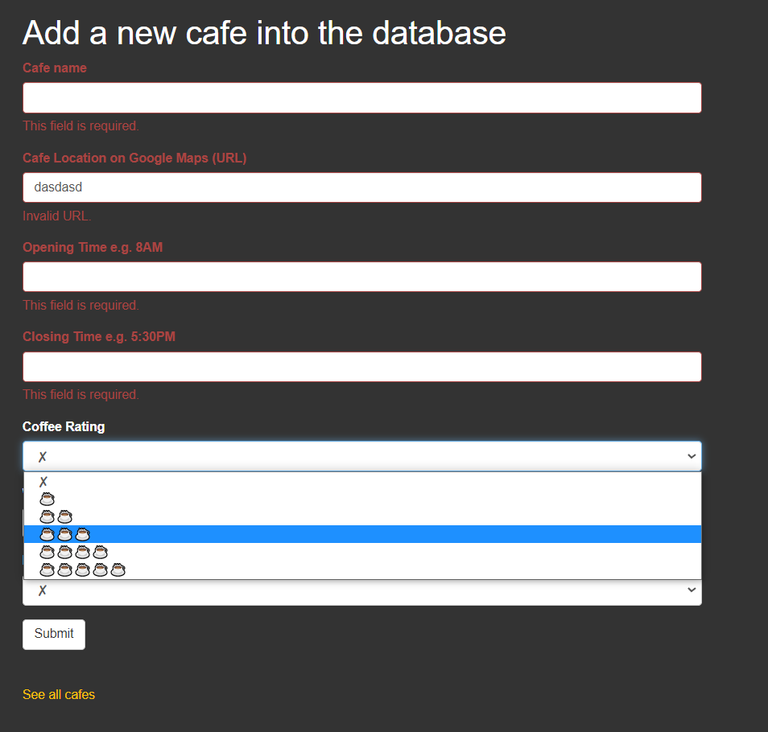

# 06_Flask_Coffee_and_WIFI_website

It is a website where the user can use it to scan for a nearby cafe and check what time they are open and if they have good coffee and easy access to wifi and power sockets in case they want to work in one of them.
The main page consists of two buttons, each of which will redirect the user either to the whole list of cafes stored, or to a site where the user can fill out the given form and add a new cafe to the list.
The cafes are stored in a csv file and handled with Python and Flask.
In order to submit the form for adding a new coffee, the user's data has to pass validation.
The form is handled using the quick_form from Flask bootstrap (https://pythonhosted.org/Flask-Bootstrap/forms.html).
Inheriting Templates Using Jinja2, Jinja2-Templates, Flask-Bootstrap, Flask-WTF, WTForms, and Forms Validation are some of the main features.

---

Flask 
https://flask.palletsprojects.com/en/2.1.x/ 

Jinja templates 
https://jinja.palletsprojects.com/en/3.1.x/ 

WTForms 
https://wtforms.readthedocs.io/en/2.3.x/ 

Flask-WTF 
https://flask-wtf.readthedocs.io/en/1.0.x/ 

Flask-Bootstrap 
https://pythonhosted.org/Flask-Bootstrap/index.html# 

CSV File Reading and Writing 
https://docs.python.org/3/library/csv.html 

---

The necessary steps to make the program work: 
1. Install the required libraries from the requirements.txt using the following command:  
*pip install -r requirements.txt* 
2. Change the name of .env.example to .env and define the environmental variable (https://flask.palletsprojects.com/en/2.2.x/config/#SECRET_KEY): 
FLASK_SECRET_KEY = "your_secret_key_keep_it_secret" 

---

**Example views from the website:** 

***The home page.*** 
 

---

***The cafes list pag.*** 
 

---

***The adding cafe page.*** 
 

---

***The adding cafe page - with validation.*** 
 

---

**The program was developed using python 3.10.6, Flask 2.2, Flask-WTF, Jinja2, Flask-Bootstrap, csv-python**

In order to run the program, you have to execute main.py.
And your website will be accessible under localhost:5000 (http://127:0:0:1:5000).