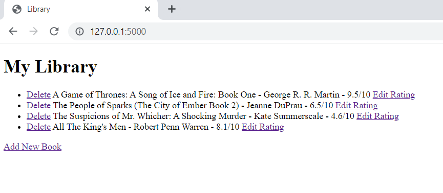
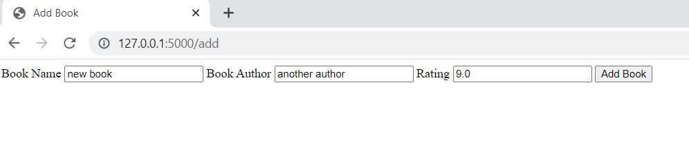
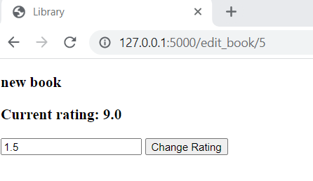
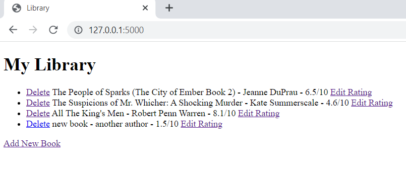

# 07_Virtual_Bookshelf

This is a website that keeps track of the books we have read and was created using the Python framework Flask.
The data is stored in a database and managed by using SQLAlchemy from Flask to serve it whenever it is needed.
The main page will display a list of all the books in the database, and the user will have the option of: 
- adding a new book to the database (title, author, rating),  
- updating the rating of an existing book, 
- deleting an existing book. 
This is a project to get more familiar with the CRUD operations with Flask SQLAlchemy.
Jinja2, Jinja2-Templates, Flask-SQLAlchemy, and Forms are some of the main features.

---

Flask 
https://flask.palletsprojects.com/en/2.1.x/ 

Flask-SQLAlchemy 
https://flask-sqlalchemy.palletsprojects.com/en/2.x/ 

Jinja templates 
https://jinja.palletsprojects.com/en/3.1.x/ 

---

The necessary steps to make the program work: 
1. Install the required libraries from the requirements.txt using the following command:  
*pip install -r requirements.txt* 
2. Change the name of .env.example to .env and define the environmental variable (https://flask.palletsprojects.com/en/2.2.x/config/#SECRET_KEY): 
FLASK_SECRET_KEY = "your_secret_key_keep_it_secret" 

---

**Example views from the website:** 

***The home page - book list.*** 
 

---

***Adding a new book view.*** 
 

---

***Editing an existing book rating view.*** 
 

---

***Home page after deleting the first book - user gets redirected.*** 
 

---

**The program was developed using python 3.10.6, Flask 2.2, Flask-SQLAlchemy, Jinja2**

In order to run the program, you have to execute main.py.
And your website will be accessible under localhost:5000 (http://127:0:0:1:5000).