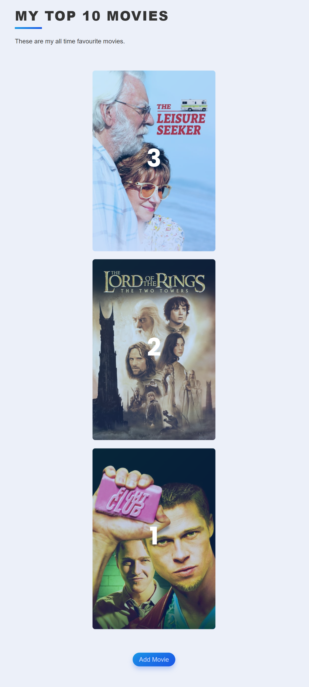
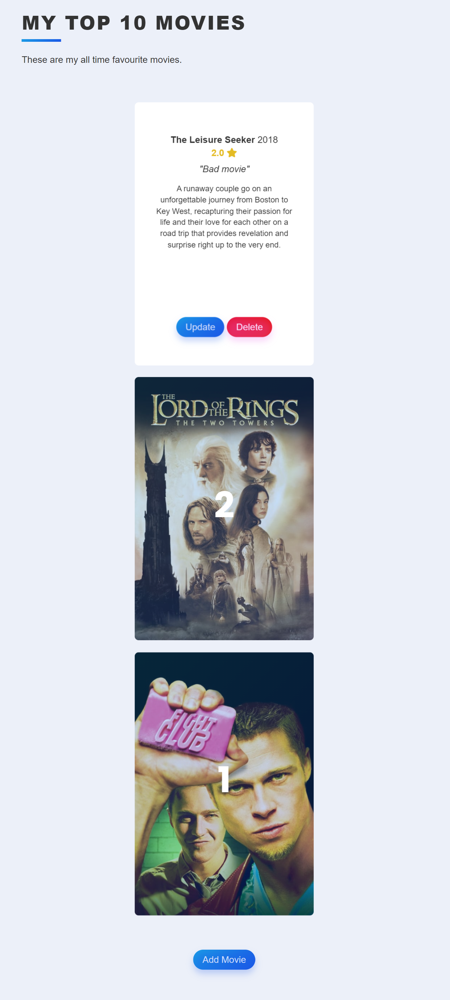
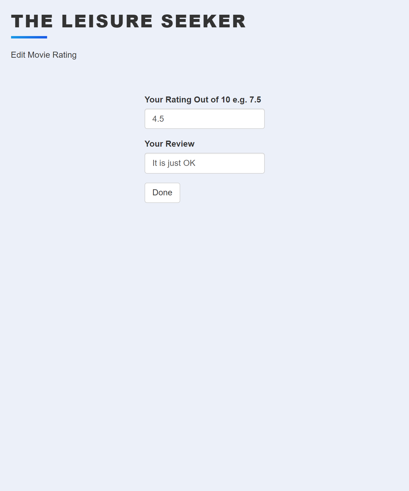
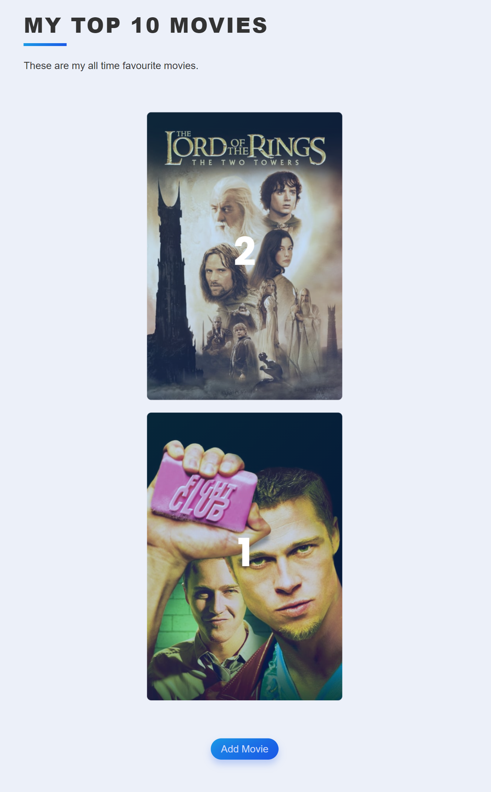
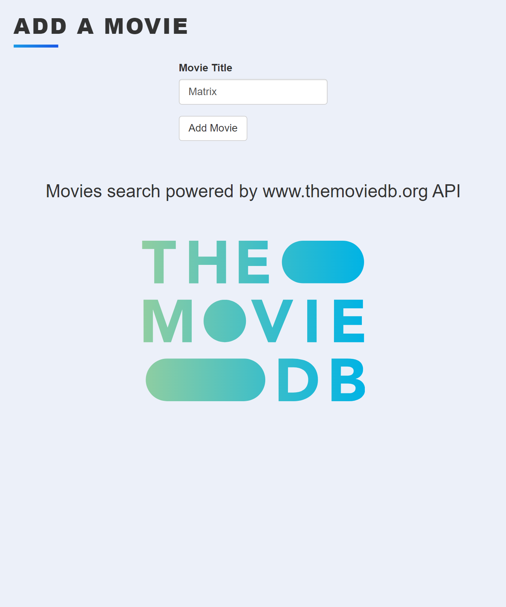
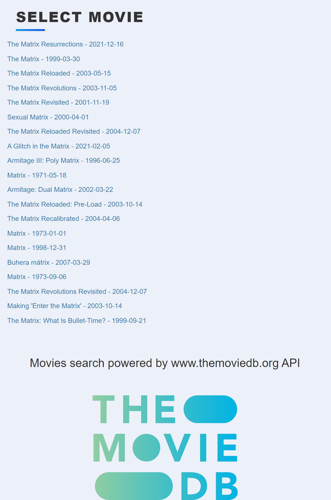
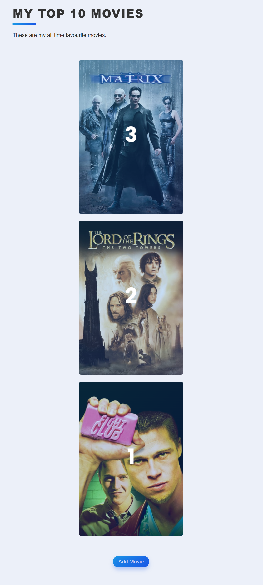

# 08_My_Top_10_Movies_Website

This is a website that compiles a list of your top favourite movies of all time.
It was developed using Python / Flask / WTForms /SQLite / SQLAlchemy / Flask-Bootstrap.
The movie data is stored in a SQLite database and managed with the help of SQLAlchemy.
The user can add movies and search for them according to titles with the help of the API 
https://www.themoviedb.org/ which will find the available movies that can be added to the list. The movies will be ordered and ranked on the main page as neatly formatted flip cards based on the user ratings.
The user also has the option to delete any of the movies from the list, as well as update the rating and review at any time. Changing ratings of the movies will result in an updated order/rank list. 

This is a project to get more familiar with the CRUD operations with Flask SQLAlchemy and get a more in-depth understanding of the powerful Flask framework.
Some of the main features are Jinja2, Jinja2-Templates, Flask-SQLAlchemy, SQLAlchemy, SQLite, WTForms, Flask-Bootstrap, consuming APIs, and many more.
The forms are handled using the quick_form from Flask bootstrap (https://pythonhosted.org/Flask-Bootstrap/forms.html). 

---

Flask 
https://flask.palletsprojects.com/en/2.1.x/ 

Flask-SQLAlchemy 
https://flask-sqlalchemy.palletsprojects.com/en/2.x/ 

SQLAlchemy 
https://docs.sqlalchemy.org/en/14/orm/query.html  

WTForms 
https://wtforms.readthedocs.io/en/2.3.x/ 

Flask-WTF 
https://flask-wtf.readthedocs.io/en/1.0.x/ 

Flask-Bootstrap 
https://pythonhosted.org/Flask-Bootstrap/index.html# 

Jinja templates 
https://jinja.palletsprojects.com/en/3.1.x/ 

---

The necessary steps to make the program work: 
1. Install the required libraries from the requirements.txt using the following command:  
*pip install -r requirements.txt* 
2. In order to make the website work you will need an API KEY which you can obtain for
free from https://developers.themoviedb.org/3/getting-started/introduction.  
3. Change the name of .env.example to .env and define the environmental variables (https://flask.palletsprojects.com/en/2.2.x/config/#SECRET_KEY): 
**FLASK_SECRET_KEY** = "your_secret_key_keep_it_secret" 
**THEMOVIEDB_API_KEY**='your_api_the_moviedb_key' 

---

**Example views from the website:** 

***The home page - flipping cards.*** 

---

***The home page - movie list.*** 
 

---

***Home page - flipped selected card.*** 
 

---

***Update movie rating and review - view.*** 
 

---

***Home page after deleting a movie.*** 
 

---

***Adding a movie page - view.*** 
 

---

***Adding a movie page - list view with the results from the API themoviedb. The User has to select which movie to add.*** 
  

---

***Home page after adding a movie.*** 
 

---

**The program was developed using python 3.10.6, Flask 2.2, Flask-SQLAlchemy, SQLite, Flask-WTF, Flask-Bootstrap, Jinja2, CSS**

In order to run the program, you have to execute main.py.
And your website will be accessible under localhost:5000 (http://127:0:0:1:5000).
