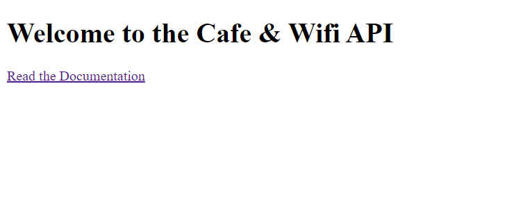
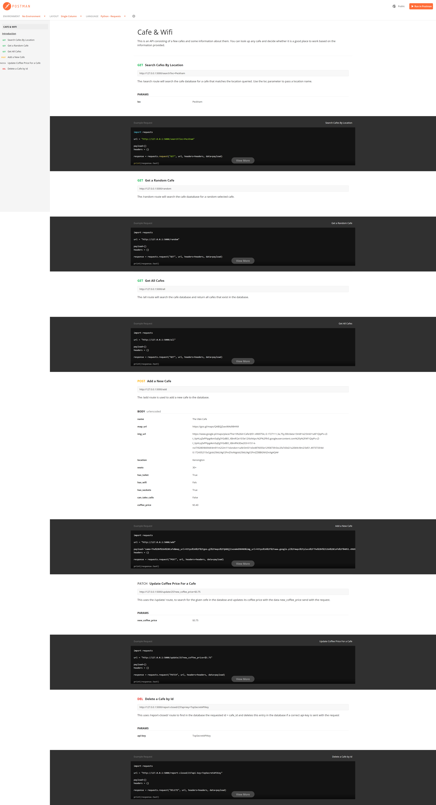

# 09_RESTful_API_CAFE_WIFI

This is a RESTful API created with Python / Flask / SQLite / SQLAlchemy.
It has a home page with a link to the documentation for the API created with the help
of Postman (https://www.postman.com/).
This RESTful API uses the data from its cafe database to respond to the users' requests.
The database consists of a list of cafes and some information about them to help the user 
to decide whether a particular cafe is a suitable place to work in.
The user can make different HTTP requests like:  
-GET (the user can request data for all the cafes, a random cafe, or a cafe by location),  
-POST (the user can add a new cafe to the database),  
-PATCH (the user can update the price of coffee for a given cafe),  
-DELETE (the user can delete a given cafe from the database, but only with a valid api_key).  

In the documentation you can find how to make all the requests with the necessary key words.

---

Flask 
https://flask.palletsprojects.com/en/2.1.x/ 

Flask-SQLAlchemy 
https://flask-sqlalchemy.palletsprojects.com/en/2.x/ 

SQLAlchemy 
https://docs.sqlalchemy.org/en/14/orm/query.html  

Testing and documentation APIs - Postman  
https://www.postman.com/  

Viewing database - SQLite browser  
https://sqlitebrowser.org/dl/  

---

The necessary steps to make the program work: 
1. Install the required libraries from the requirements.txt using the following command:  
*pip install -r requirements.txt* 
2. Change the name of .env.example to .env and define the environmental variables (https://flask.palletsprojects.com/en/2.2.x/config/#SECRET_KEY): 
**FLASK_SECRET_KEY** = "your_secret_key_keep_it_secret" 

---

**Example views from the website:** 

***The home page with a link to the documentation.*** 

---

***documentation - overview.*** 
***https://documenter.getpostman.com/view/23653195/2s83tFGWqi*** 
***docs/Cafe & Wifi - documentation.pdf*** 
 

---

**The program was developed using python 3.10.6, Flask 2.2, Flask-SQLAlchemy, SQLite**

In order to run the program, you have to execute main.py.
And your website will be accessible under localhost:5000 (http://127:0:0:1:5000).