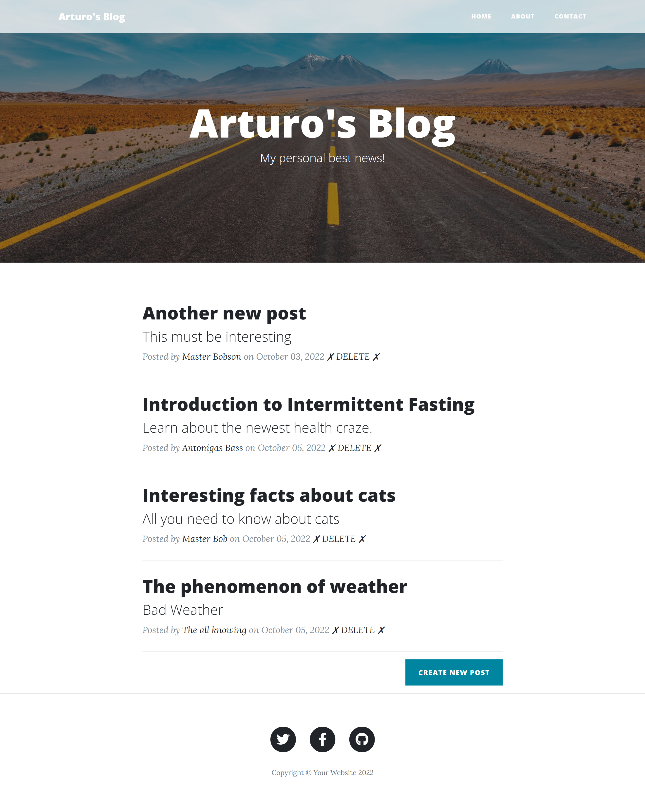
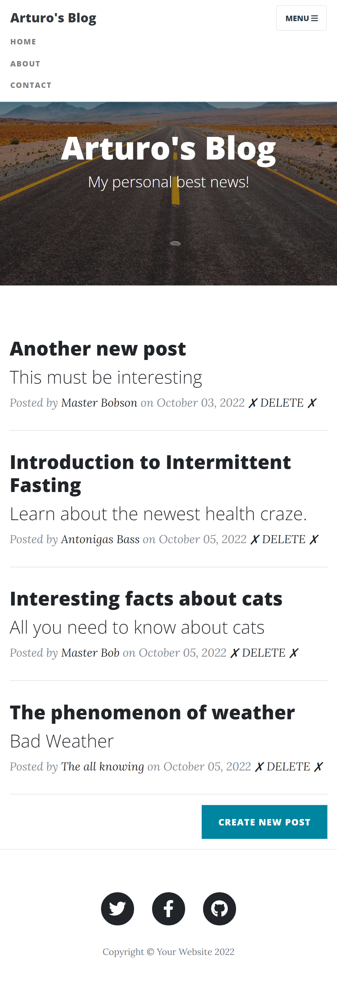
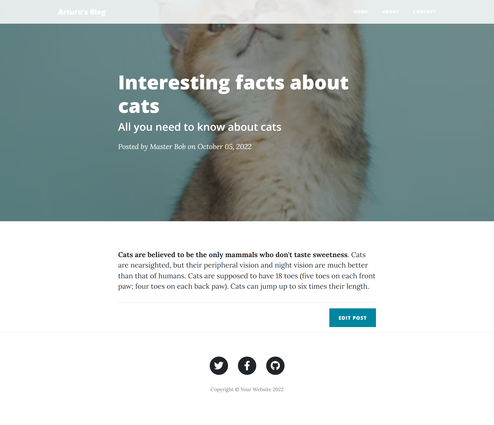
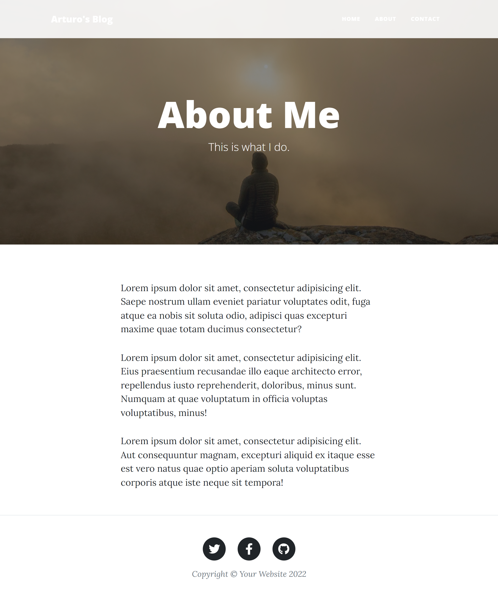
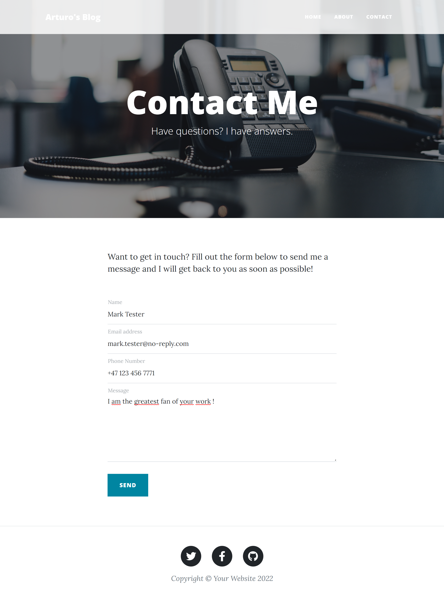
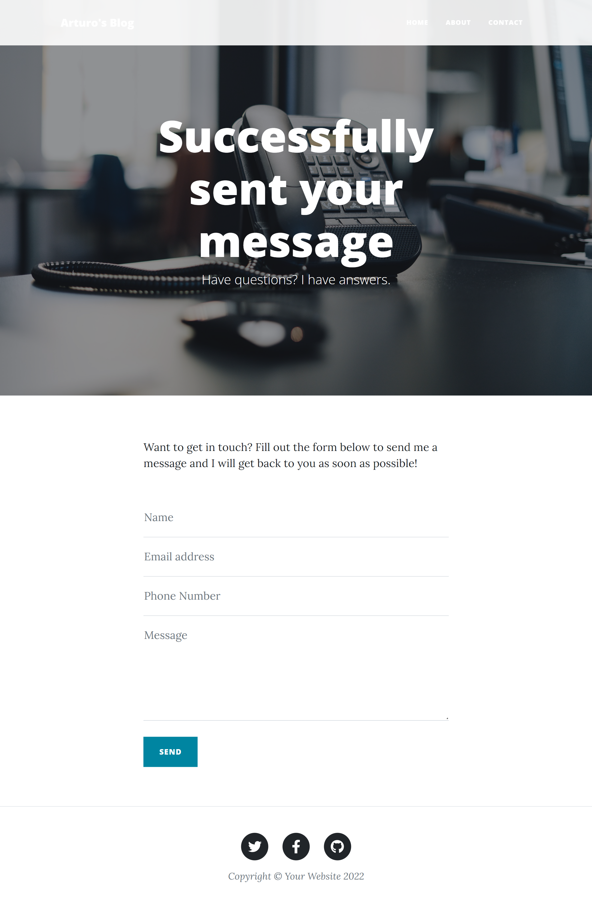
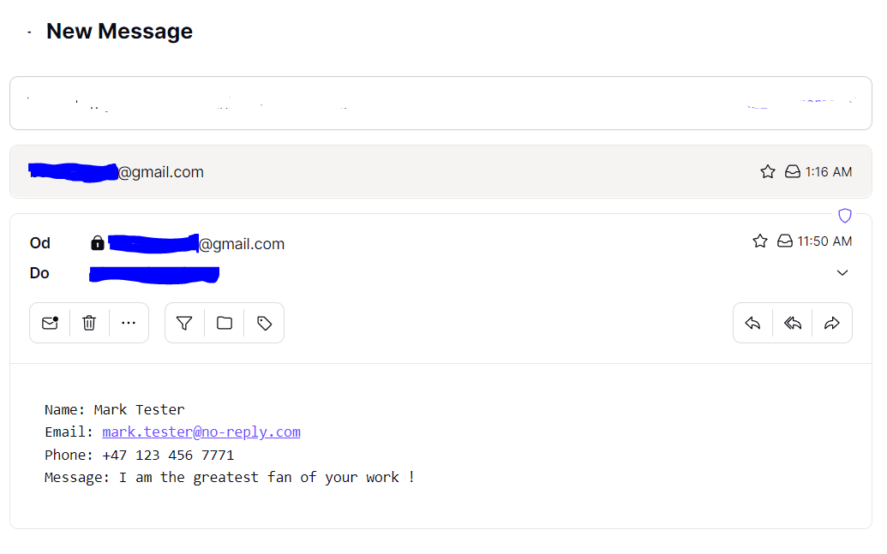
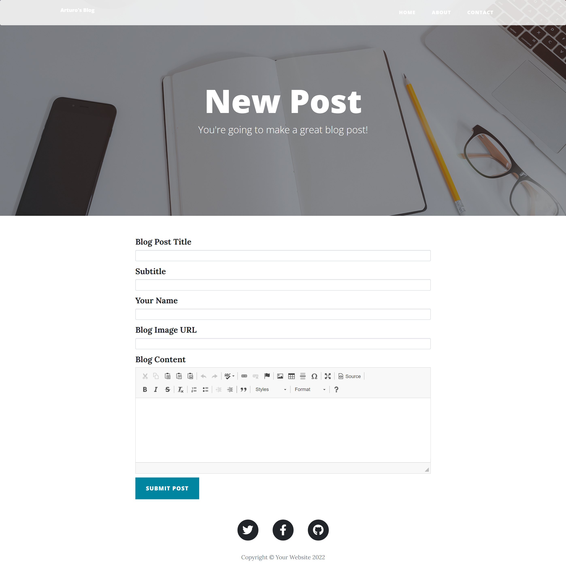
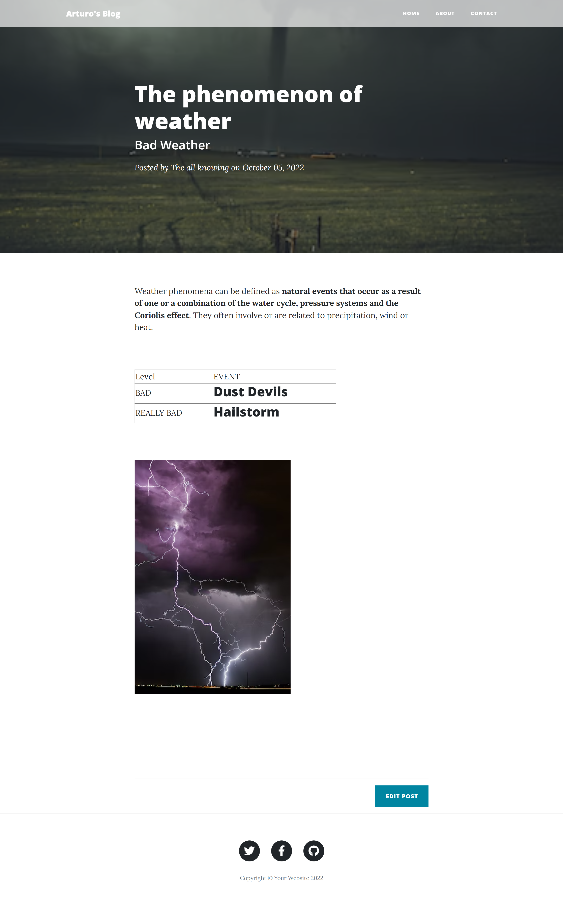
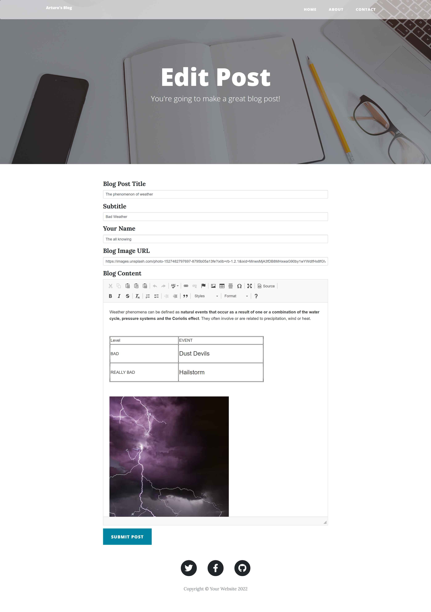

# 10_RESTful_Blog_website_part_III

This is a blog website that is basically an upgraded version of the 04_Blog_website_II, which was built using the Python framework Flask. The styling was done with the help of additional Bootstrap templates (https://startbootstrap.com/previews/clean-blog), Flask-Bootstrap, Bootstrap, CSS. The main features are: 
- RESTful Blog - with the blog you will be able to create new posts, edit and delete existing posts from the database (Flask HTTP requests and forms WTF), 
- CKEditorField - The CK Editor field renders the CK editor control that allows users to visually work with HTML and save the results back into a text property. 
- all the posts will be stored in a SQLite database and managed with Flask-SQLAlchemy, 
- dynamically generated blogpost pages with full screen titles, 
- multi-page website with an interactive navigation bar, 
- fully mobile responsive with an adaptive navigation bar,  
- fully functional contact form (POST request - Flask) that will send an email form to the specified email receiver, 
- error handling - 404 - page not found. 

The data for each post is stored using an SQLite database and managed with the help of Flask-SQLAlchemy.
The blog can perform POST, GET, DELETE HTTP request in order to create, edit or delete a post in the database.

The main page consists of a list of posts (titles and subtitles), with the option to open each post, which will redirect the user into a detailed view of the given post. The user can also add a post from the main page with the help of the button: Create new Post. On top of that, from the detail view of each post can be edited.
The adaptive navabr has the options of about, contact, and home page. The contact view has a form where the user can fill up the required data and send it to the server as a POST request, which will be processed and sent to the given email address in the form with a short message.

---

Flask 
https://flask.palletsprojects.com/en/2.1.x/ 

Flask-SQLAlchemy 
https://flask-sqlalchemy.palletsprojects.com/en/2.x/ 

SQLAlchemy 
https://docs.sqlalchemy.org/en/14/orm/query.html  

Viewing database - SQLite browser  
https://sqlitebrowser.org/dl/  

Jinja templates 
https://jinja.palletsprojects.com/en/3.1.x/ 

WTForms 
https://wtforms.readthedocs.io/en/2.3.x/ 

Flask-WTF 
https://flask-wtf.readthedocs.io/en/1.0.x/ 

Flask-CKEditor 
https://flask-ckeditor.readthedocs.io/en/latest/basic.html 

Flask-Bootstrap 
https://pythonhosted.org/Flask-Bootstrap/index.html# 

Bootstrap  
https://getbootstrap.com/  

Email SMTP  
https://docs.python.org/3/library/smtplib.html  

---

The necessary steps to make the program work: 
1. Install the required libraries from the requirements.txt using the following command:  
*pip install -r requirements.txt* 
2. Before using the program, we need to create a Gmail account that the program can use and generate an app_pssword for our account (https://help.prowly.com/how-to-create-use-gmail-app-passwords). After creating the Gmail account, we have to change the name of .env.example to .env and define the environmental variables according to our account: 
MY_EMAIL = "EXAMPLE.USER@gmail.com" 
GMAIL_APP_PASSWORD = "GMAIL_APP_PASSWORD" 
3. Define the Flask environmental variables in .env (https://flask.palletsprojects.com/en/2.2.x/config/#SECRET_KEY): 
**FLASK_SECRET_KEY** = "your_secret_key_keep_it_secret" 
4. Adjust the variable **EMAIL_RECIVER** in the file main.py. This the the host email, where all the emails from contact form will be sent to.

---

**Example views from the website:** 

***The home page - desktop view.*** 
 

---

***The home page - mobile view.*** 
 

---

***Detailed post view.*** 
 

---

***The About page.*** 
 

---

***The Contact page with the contact form filled in.*** 
 

---

***After successfully submitting the contact form, the contact page appears with a message*** 
 

---

***Example email received from the website.*** 
 

---

***Create a new post view.*** 
 

---

***Detail Post view - after adding a post.*** 
 

---

***Edit a post view.*** 
 

---

**The program was developed using python 3.10.6, Flask 2.2, Flask-Bootstrap, Flask-CKEditor, Flask-SQLAlchemy, Flask-WTF, SQLite, Email SMTP**

In order to run the program, you have to execute main.py.
And your website will be accessible under localhost:5000 (http://127:0:0:1:5000).
