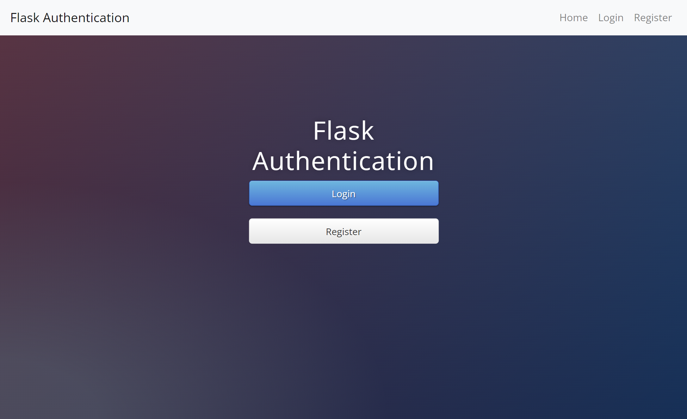
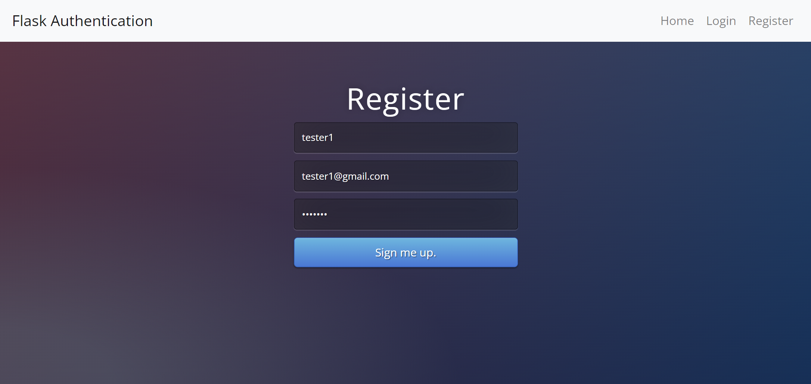
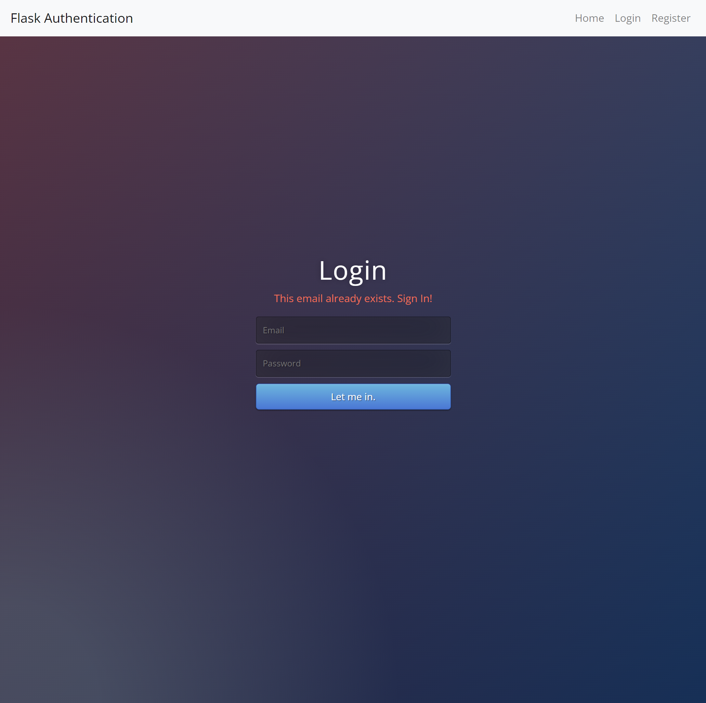
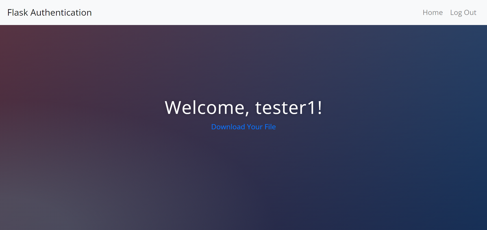
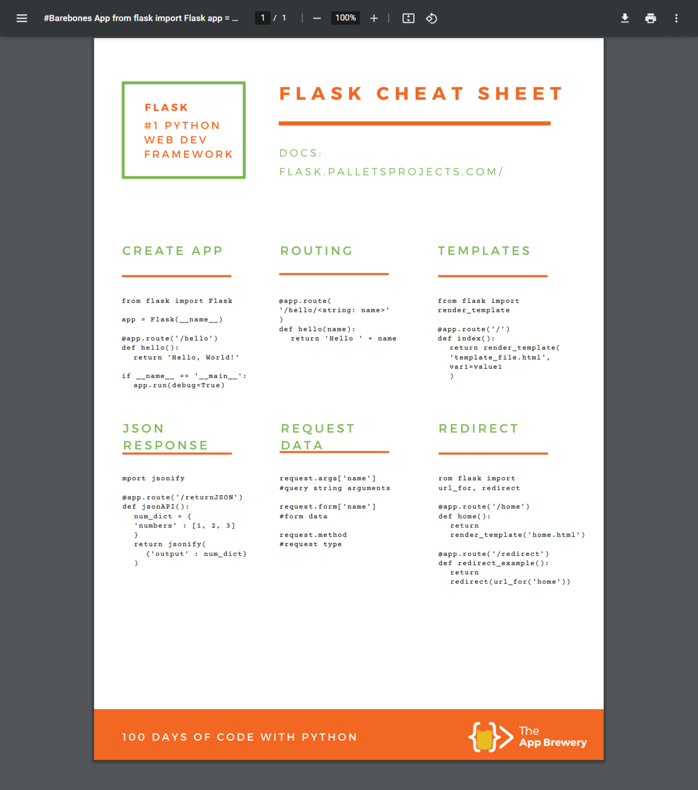
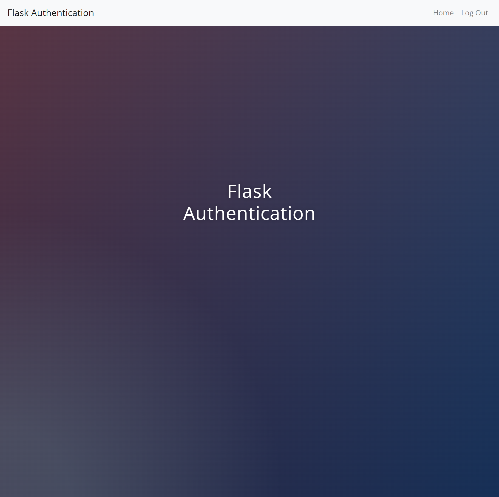
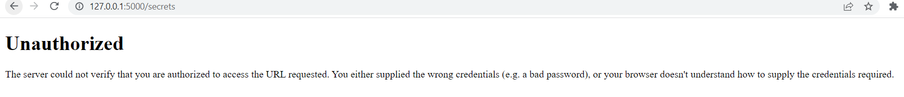

# 11_Flask_Authentication

This is a website where the user has to register in order to be allowed to download the secret file cheat_sheet.pdf.
After registration, the users' data will be stored securely in the database and the next time the user will be able to login.
When the user gets registered, the email address, user name , and hashed password with salt are stored in the database instance/users.db.
This website shows how authetication is done with the use of Flask and Flask-login while maintaining the highest security by hashing the user passwords and adding salt to them and then storing the hash in the database instead of the password itself.
If the user is not logged in and tries to access the routes /download or/secrets, the server will respond with 401 HTTP-Unauthorized. Only logged in / authenticated users will have access to these routes.
In order to give a better user experience, Flask flash messaging was implemented to give feedback to the user if the email address is incorrect, like it exists in the database, or if the email address does not exist and the user tries to login, or if the password was wrong, like it does not match to the email.  

---

Flask 
https://flask.palletsprojects.com/en/2.1.x/ 

Flask-Login 
https://flask-login.readthedocs.io/en/latest/ 

Hashing password 
https://werkzeug.palletsprojects.com/en/2.2.x/utils/#werkzeug.security.generate_password_hash  

Flask - Message Flashing 
https://flask.palletsprojects.com/en/2.2.x/patterns/flashing/#message-flashing 

Flask-SQLAlchemy 
https://flask-sqlalchemy.palletsprojects.com/en/3.0.x/ 

SQLAlchemy 
https://docs.sqlalchemy.org/en/14/orm/query.html  

Viewing database - SQLite browser  
https://sqlitebrowser.org/dl/  

WTForms 
https://wtforms.readthedocs.io/en/2.3.x/ 

Flask-WTF 
https://flask-wtf.readthedocs.io/en/1.0.x/ 

---

The necessary steps to make the program work: 
1. Install the required libraries from the requirements.txt using the following command:  
*pip install -r requirements.txt* 
2. Change the name of .env.example to .env and define the Flask environmental variables in .env (https://flask.palletsprojects.com/en/2.2.x/config/#SECRET_KEY): 
**FLASK_SECRET_KEY** = "your_secret_key_keep_it_secret" 

---

**Example views from the website:** 

***The home page - user not logged in.*** 
 

---

***User - Register view.*** 
 

---

***User - Register view - error email exists.*** 
 

---

***User - Login view - error email exists.*** 
 

---

***After successful login, redirect to /secrets.*** 
 

---

***Login users can download the secrets.*** 
 

---

***Home page view - logged in user.*** 
 

---

***If user is not logged in - the routes /secrets or /downloads will be inaccessible - the server will respond with 401 - unauthorzied.*** 
 

--- 

**The program was developed using python 3.10.6, Flask 2.2, Flask-Login, Flask - Message Flashing, Flask-SQLAlchemy, SQLite, Hashing passwords with Wergzeug**

In order to run the program, you have to execute main.py.
And your website will be accessible under localhost:5000 (http://127:0:0:1:5000).
