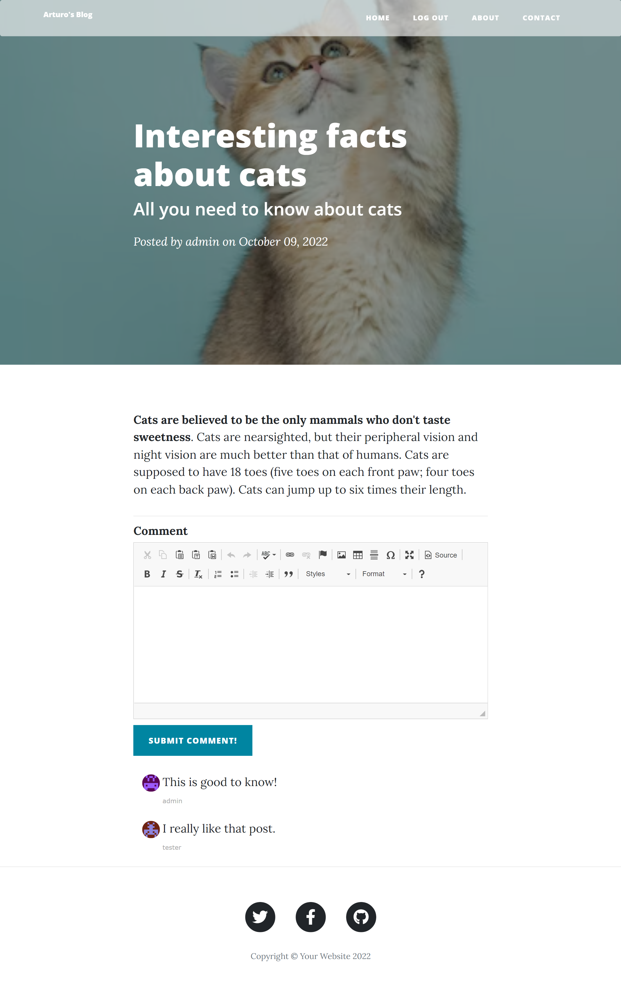

# 13_Blog_website_heroku_ready_part_V

Deployed on Heroku: https://arturos-blog.herokuapp.com/

This is a fully-fledged blog website that is ready to be published and launched on Heroku (https://www.heroku.com/). It's an upgraded version of the previous blog website (12_Blog_website_with_Users_part_IV). The blog was developed using the Python framework Flask. The styling was done with the help of additional Bootstrap templates (https://startbootstrap.com/previews/clean-blog), Flask-Bootstrap, Bootstrap, and CSS. Some extra functionality like registering and authenticating users was added, as well as the ability for authenticated users to comment on blog posts.  
The main features are: 
- RESTful Blog: with the blog you will be able to create new posts, edit and delete existing posts from the database (Flask HTTP requests and forms WTF). Only the admin user (id = 1), the first user to register on the blog, will have these rights.  
- Authentication-users for the website and giving different permissions. There will be 3 groups that are distinguished: admin, logged users, and anonymous users (not logged in).  
- all the posts will be stored in a SQLite database and managed with Flask-SQLAlchemy. 
- use of Gravatar images to provide an avatar image for blog commenters. 
- Making use of Relational Databases (one-to-many relationship). 
- Message Flashing using Flask Flash to give feedback to the user. They will be visible only for one session.  
- CKEditorField-The CK Editor field renders the CK editor control that allows users to visually work with HTML and save the results back into a text property.  
- blog post pages with full-screen titles that are generated dynamically.  
- multi-page website with an interactive navigation bar. 
- fully mobile responsive with an adaptive navigation bar. 
- a fully functional contact form (POST request-Flask) that will send an email form to the specified email receiver.  
- customised error handling-403-page Forbidden. 
- customised error handling-404-page not found.  
 

The data for each post, user, and comment is stored respectively in three different tables using an SQLite database (if launched locally) and PostgreSQL when launched from Herokoku and managed with the help of Flask-SQLAlchemy.
Heroko will erase the whole SQLite database every 24 hours (https://devcenter.heroku.com/articles/sqlite3#disk-backed-storage) so it is necessary to set up a PostgreSQL database on Heroku and connect it to our database. The only thing we will have to do is to add in our Heroku app from the resources tab, the Heroku - Postgres adds on, after which a secret key in the Config Vars will be added, called DATABASE_URL.
If this environmental variable is found, the website will use the new Heroku Postgres database, otherwise it will try to tap into the SQLite database, which is wiped every 24 hours.
Between these three tables, there exists a database relationship "A one to many", which makes it easy to locate all the comments belonging to each post or all the blog posts belonging to a specific user.
The blog can perform POST, GET, and DELETE HTTP requests in order to create, edit, or delete a post in the database.
As mentioned earlier, there will be three groups of users:  
- admin (id = 1, the first user that registers on the blog),  
- logged users (any user that has registered after the admin),  
- anonymous users (not logged in).  

Depending on the group the user belongs to, they will be able to perform different tasks on the blog.  
Admin users will have all rights over the blog website. They will be able to read, create, update, and delete posts, as well as comment on the blog posts.  
Regular logged-in users will be allowed only to read posts and comment on them.  
The anonymous users/not logged in users will be allowed only to read the posts.   

The main page consists of a list of posts (titles and subtitles), with the option to open each post, which will redirect the user into a detailed view of the given post. The admin user can add a post from the main page with the help of the button: Create New Post. On top of that, from the detail view, each post can be edited but only by an admin user.
The adaptive navigation has different options depending on whether a user is authenticated or not.   
Authenticated users will have the options: HOME, LOGOUT, ABOUT, CONTACT.   
Not-Authenticated users (not logged in) will have the options: HOME, LOGIN, REGISTER, ABOUT, CONTACT.   

The contact view has a form where the user can fill up the required data and send it to the server as a POST request, which will be processed and sent to the given email address in the form with a short message.

Each user that wants to be authenticated needs to register. After registering, the users' data will be stored securely in the database. Afterwards, the user can simply log in to the blog.
When the user gets registered, the email address, user name, and hashed password with salt are stored in the database in the users table. This website shows how authentication is done with the use of Flask and Flask-login while maintaining the highest security by hashing the user passwords and adding salt to them and then storing the hash in the database instead of the password itself.

If the user is not logged in or does not have permission to access a specific website, the server will respond with a customised error message either:  
- HTTP 403: Forbidden  
- HTTP 404: page not found  

In order to give a better user experience, Flask flash messaging was implemented to give feedback to the user if the email address is incorrect, like if it already exists in the database, or if the email address does not exist and the user tries to login, or if the password was wrong. The flash messages will be visible only for one session.

---

Database Schema: 

 

---

Useful Links:

Deploying your web application with heroku  
https://www.heroku.com/  

Flask 
https://flask.palletsprojects.com/en/2.1.x/ 

Flask-Login 
https://flask-login.readthedocs.io/en/latest/ 

Hashing + Salting a password 
https://werkzeug.palletsprojects.com/en/2.2.x/utils/#werkzeug.security.generate_password_hash 

Flask - Message Flashing 
https://flask.palletsprojects.com/en/2.2.x/patterns/flashing/#message-flashing 

Flask-SQLAlchemy 
https://flask-sqlalchemy.palletsprojects.com/en/3.0.x/ 

SQLAlchemy 
https://docs.sqlalchemy.org/en/14/orm/query.html  
 
ONE-TO-MANY Database relationships 
https://docs.sqlalchemy.org/en/14/orm/basic_relationships.html?highlight=one+many  

Custom Error Pages 
https://flask.palletsprojects.com/en/1.1.x/patterns/errorpages/ 

Flask-Gravatar 
https://pythonhosted.org/Flask-Gravatar/ 

Flask decorators 
https://flask.palletsprojects.com/en/1.1.x/patterns/viewdecorators/#login-required-decorator 

Viewing database - SQLite browser  
https://sqlitebrowser.org/dl/  

Jinja templates 
https://jinja.palletsprojects.com/en/3.1.x/ 

WTForms 
https://wtforms.readthedocs.io/en/2.3.x/ 

Flask-WTF 
https://flask-wtf.readthedocs.io/en/1.0.x/ 

Flask-CKEditor 
https://flask-ckeditor.readthedocs.io/en/latest/basic.html 

Flask-Bootstrap 
https://pythonhosted.org/Flask-Bootstrap/index.html# 

Bootstrap  
https://getbootstrap.com/  

Email SMTP  
https://docs.python.org/3/library/smtplib.html  

---

The necessary steps to make the program work: 
1. Install the required libraries from the requirements.txt using the following command:  
*pip install -r requirements.txt* 
2. Before using the program, we need to create a Gmail account that the program can use and generate an app_pssword for our account (https://help.prowly.com/how-to-create-use-gmail-app-passwords). After creating the Gmail account, we have to change the name of .env.example to .env and define the environmental variables according to our account: 
MY_EMAIL = "EXAMPLE.USER@gmail.com" 
GMAIL_APP_PASSWORD = "GMAIL_APP_PASSWORD" 
3. Define the Flask environmental variables in .env (https://flask.palletsprojects.com/en/2.2.x/config/#SECRET_KEY): 
**FLASK_SECRET_KEY** = "your_secret_key_keep_it_secret" 
4. Define the Host email in the environmental variables .env **HOST_EMAIL_FOR_CONTACT_FORM**
This is the the host email, where all the emails from the contact form will be sent to.
5. You have the option of using the existing database (at this point you will use SQLite ) with defined users or creating a new one. 
user id = 1  
email: admin@gmail.com 
password: admin 
user id = 2  
email: tester@gmail.com 
password: tester 
Alternatively, you can simply delete the database instance/blog.db and then run main.py.
A new empty database will be created, and you will have to register the users and create new posts (the first registered user will become the admin!). 
I recommend using the SQLite browser to explore the data currently saved in the database. 
6. Execute main.py to ensure that the website is operational on your local host. 
--- Next step is deploying and launching on Heroku --- 
7. Download and install git https://git-scm.com/. 
8. Sign up for a free Github account at https://github.com/. 
9. Using git version control, commit your project locally and create a new repository on GitHub. 
You will have to push your local commit to it. 
10. Sign up for a free Heroku account at https://www.heroku.com/. 
11. Create a new Heroku app, select GitHub as the deployment method, and connect to your account. 
Next you will have to select (search by name) your repository that you created and pushed to your local commit (see step 9). Dont forget to enable Automatic Deploys - this means that whenever you push a new commit to your remote GitHub repository, it will automatically re-deploy your server with the changes. Next, you will have to deploy the Brnach. 
12. The final step is to define your environmental variables and upgrade from SQLite to PostgreSQL.
In your app, under the Resources tab, add an add-on called Heroku Postgres, and choose a free plan.
By doing so, you should see under settings in the section of Config Vars a defined variable DATABASE_URL - at this point, the website will use the new PostgreSQL database. 
Add the rest of the variables by defining: 
**your secret flask key** 
FLASK_SECRET_KEY = 'your_secret_key_keep_it_secret' 
**a Gmail account through which emails will be sent** 
MY_EMAIL = "EXAMPLE.USER@gmail.com" 
**your gmail app password** 
GMAIL_APP_PASSWORD = "GMAIL_APP_PASSWORD" 
**where all the emails from the contact form will be sent to** 
HOST_EMAIL_FOR_CONTACT_FORM = "YOUR_HOST_EMAIL_FOR_CONTACT_FORM@gmail.com" 
13. Now your website should be running. You will have to register the first user that will be the admin and then you will be able to add/create posts. 

---

**Example views from the website:** 

***The home page - mobile view.*** 
 

---

***The home page - desktop view - user is not logged in.*** 
 

---

***The home page - desktop view - admin user is logged in.*** 
 

---

***The About page.*** 
 

---

***The Contact page with the contact form filled in.*** 
 

---

***After successfully submitting the contact form, the contact page appears with a message*** 
 

---

***Example email received from the website.*** 
 

---

***Login View after unsuccessful login before - red flash message indicating the problem.*** 
 

---

***Register a user view.*** 
 

---

***New/Add post view - only accessible with an admin user logged in.*** 
 

---

***Detailed post view - admin user logged in - permission to edit and comment.*** 
 

---

***Detailed post view - regular user logged in - only permission to comment.*** 
 

---

***Edit a post view - possible only with an admin user logged in.*** 
 

---

**The program was developed using python 3.10.6, Flask 2.2, Flask-Login, Flask - Message Flashing, Flask-Bootstrap, Flask-CKEditor, Flask-SQLAlchemy, Flask-WTF, SQLite, PostgreSQL, Email SMTP, Hashing passwords with Wergzeug, Flask-Gravatar, Customized Flask decorators**

In order to run the program, you have to execute main.py.
And your website will be accessible under localhost:5000 (http://127:0:0:1:5000).
